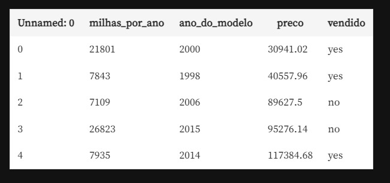

# Algoritmo KNN  - Trabalho Módulo 1
## Por: Matheus Mendonca Lopes, Otávio Santos, Raphael Griffoni, Vinícius Leôncio

Base de dados usada: https://gist.githubusercontent.com/guilhermesilveira/4d1d4a16ccbf6ea4e0a64a38a24ec884/raw/afd05cb0c796d18f3f5a6537053ded308ba94bf7/car-prices.csv

Compreendendo a base de dados:   
- A primeira coluna contém o ID de cada veículo. Essa informação não será necessária para a classificação.
- **milhas_por_ano**: representa quantas milhas em média o carro andou por ano.
- **ano_do_modelo**: representa o ano de fabricação do veículo.
- **preco**: representa o preço do veículo.
- **vendido**: rótulo de classificação para o algoritmo.
  
**Os dados de teste serão os últimos 500 da base de dados do link, os quais serão removidos da base de treino.**